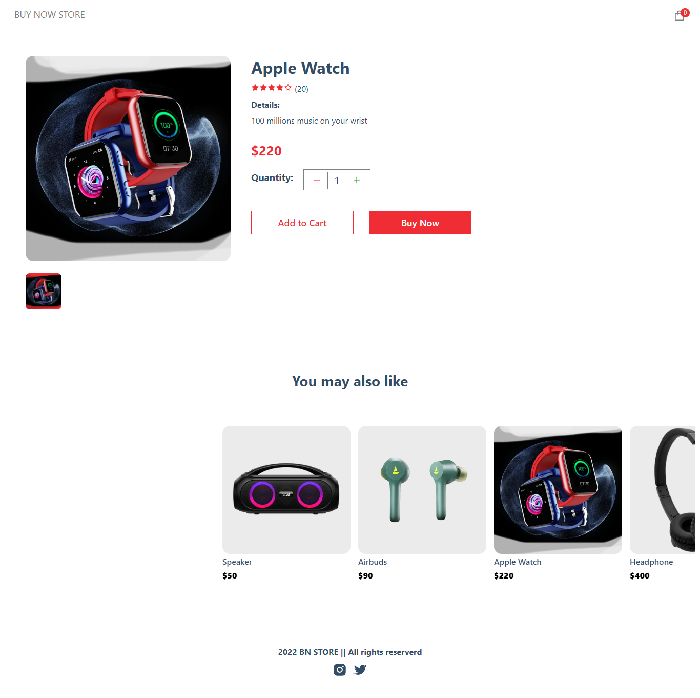
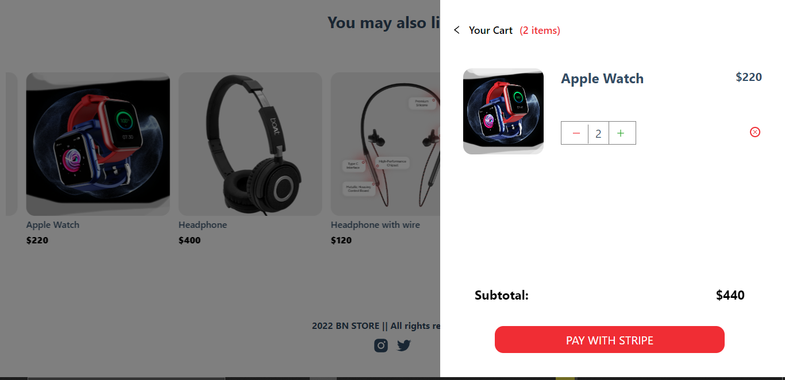
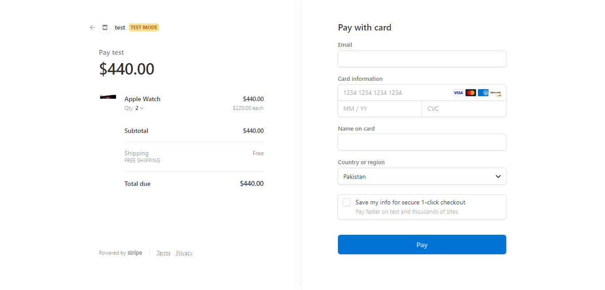
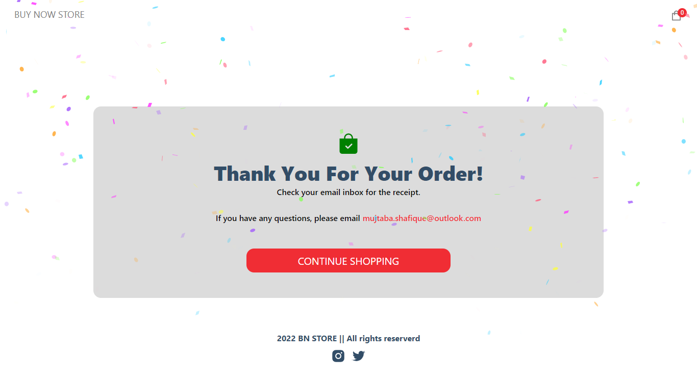

Ecommerce site which is create in NEXT.JS with ReactJS. Sanity to manage backend like we can add banner and products dynamically. And stripe for payment method.
## Website Link: 






First, run the development server:

```bash
npm run dev
